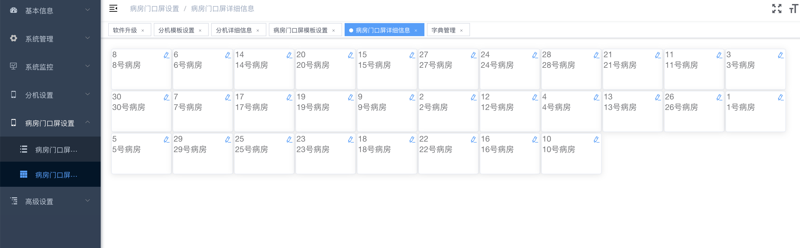
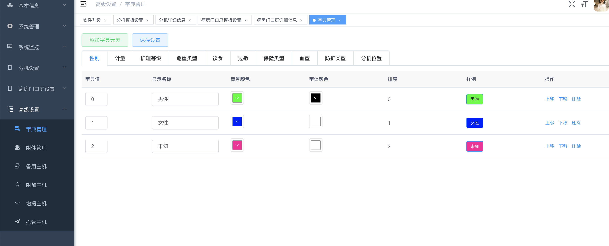
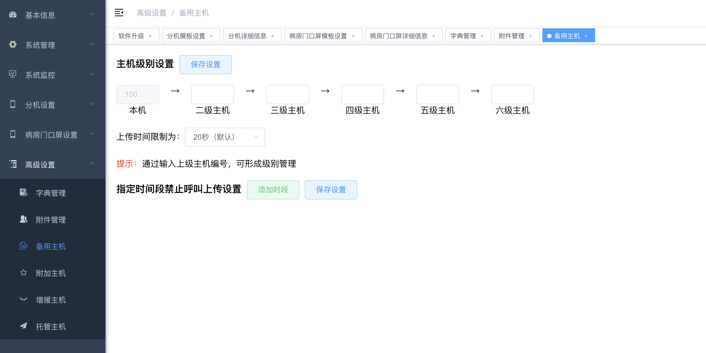
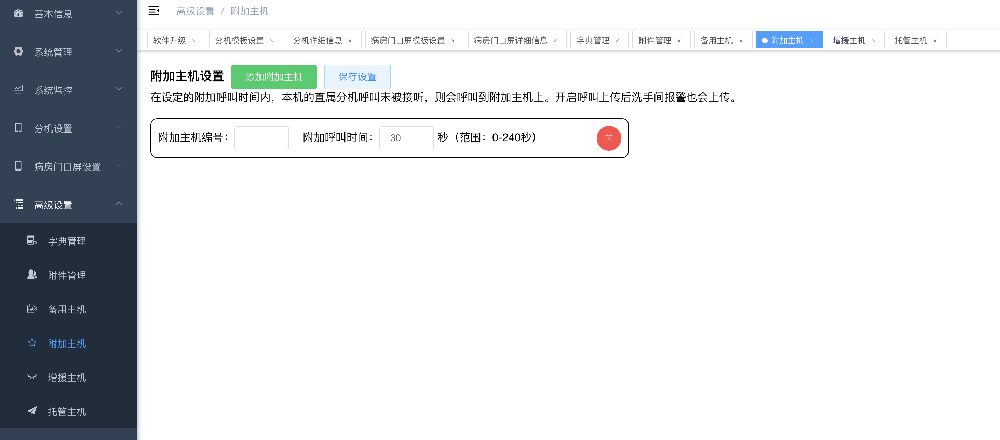
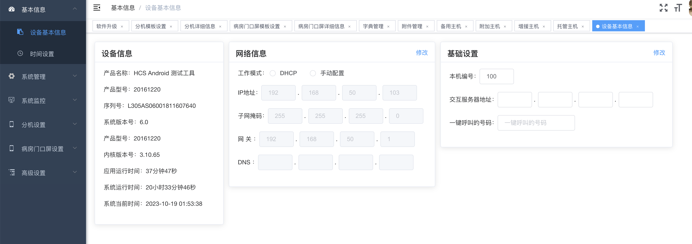
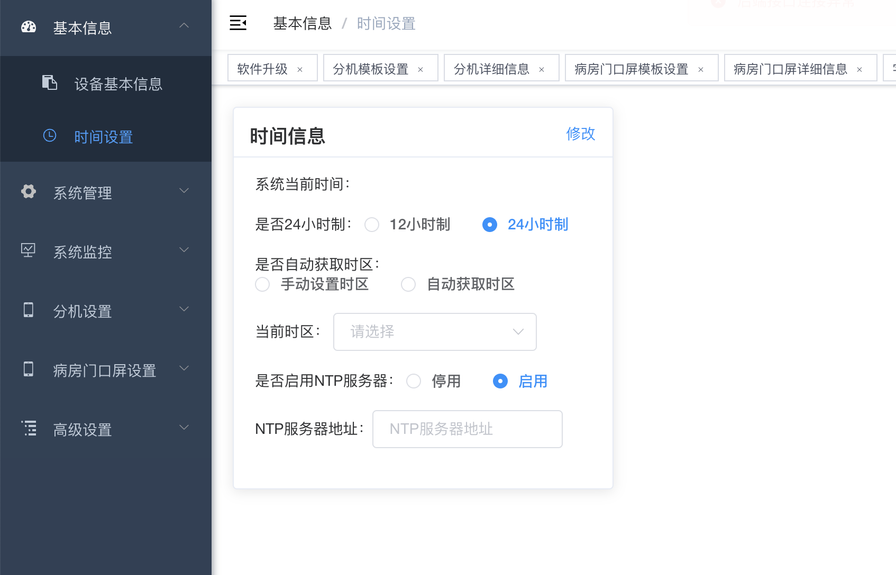

## 开发

```bash
# 克隆项目 (请用ssh的形式克隆，因为里面包含的子模块都是已ssh的形式添加的)
git clone git@192.168.50.140:hcs/hcs-web-nurse-master.git

# 下载子模块
# 依赖的web子模块有
# 页面框架模块 hcs-web-module-base https://github.com/netwolf712/hcs-web-module-base.git
# 通用运维管理模块 hcs-web-module-maintain https://github.com/netwolf712/hcs-web-module-maintain.git
# 医护对讲核心业务模块 hcs-web-module-master https://github.com/netwolf712/hcs-web-module-master.git
进入hcs-web-maintain目录后，调用
git submodule update --init --recursive
递归下载子模块

# 建议不要直接使用 cnpm 安装依赖，会有各种诡异的 bug。可以通过如下操作解决 npm 下载速度慢的问题
npm install --registry=https://registry.npmmirror.com

# 启动服务
npm run dev
```

浏览器访问 http://localhost:1024

## 发布

```bash
# 构建测试环境
npm run build:stage

# 构建生产环境
npm run build:prod
```

_请与 nurse-station-master 保持在平级的目录，这样编译时可以自动将静态文件放入 app 的 assets 目录下，具体可查看 vue.config.js 下的 outputDir 配置。也可根据实际情况自行调整编译输出目录_


## node版本
实测v13.14.0正常，其它版本不能确定。
注：可以用nvm管理多个node版本

## 示例图片
- 示例图片
<table>
    <tr>
        <td></td>
        <td></td>
    </tr>
    <tr>
        <td></td>
        <td></td>
    </tr>     
    <tr>
        <td></td>
        <td></td>
    </tr>    
    <tr>
        <td></td>
        <td></td>
    </tr>    
</table>